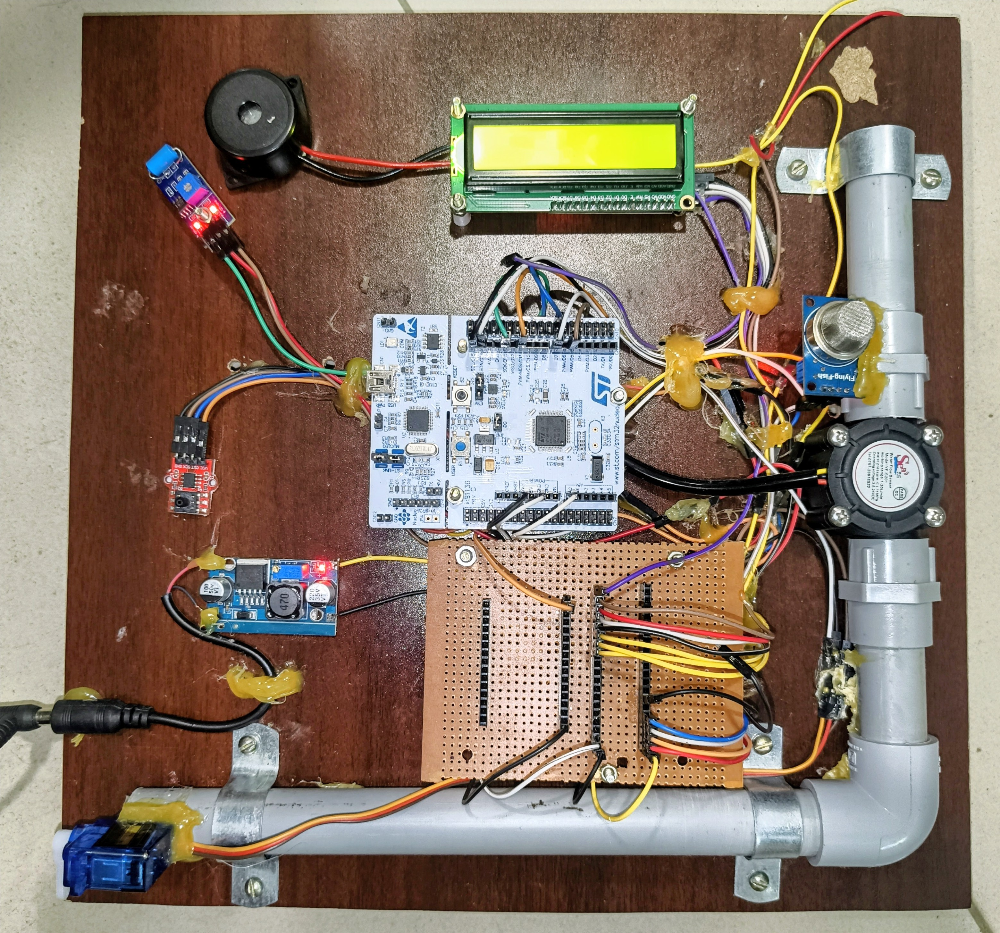

# 🚨 Industrial Gas Asset Monitoring System (STM32 + IoT + Digital Twin)

## 📌 Overview

A full-stack industrial safety system for real-time monitoring of gas pipelines using **STM32**, **Flask**, and a **SCADA + 3D Digital Twin interface**.

The current implementation demonstrates a **single-node monitoring system**, capable of detecting and classifying hazardous conditions such as:

* Gas leaks
* Pressure anomalies
* Flow irregularities
* Mechanical vibrations

The system integrates **embedded sensing + backend processing + real-time visualization**, with a clear roadmap to scale into a distributed industrial pipeline network.

---

## 🧱 System Architecture (Current System)

STM32 → Serial (UART) → Flask Backend → WebSocket → Frontend (SCADA + React + Digital Twin)

---

## ⚙️ Features

### 🔹 Embedded System (STM32)

* Multi-sensor integration:

  * MQ2 Gas Sensor
  * HX710B Pressure Sensor
  * Flow Sensor
  * DHT11 Temperature Sensor
  * Vibration Sensor
* Priority-based 4-level alert system
* Hysteresis thresholding (reduces false alarms)
* Auto-calibration for gas sensor
* Non-blocking buzzer alert patterns

---

### 🔹 Backend (Flask)

* Serial data acquisition from STM32
* Real-time WebSocket communication (Socket.IO)
* AI-based anomaly prediction
* Excel logging using Pandas & OpenPyXL

---

### 🔹 Frontend

#### 🖥️ SCADA Dashboard

* `pipeline.html`
* Lightweight monitoring interface
* Real-time sensor visualization

#### 🌐 React Dashboard + Digital Twin

* Live charts and alerts
* 3D pipeline visualization using Three.js
* Real-time system state mapping

---

## 📁 Project Structure

```
industrial-gas-monitoring-stm32-iot/
│
├── firmware/              # STM32 Embedded C code
├── backend/               # Flask server + AI + logging
├── frontend/
│   ├── scada/             # pipeline.html (SCADA)
│   ├── react-dashboard/   # React + Digital Twin
│
├── data-logs/             # Excel logs
└── README.md
```

---

## 🚀 How to Run the Full System

### 🔹 1. Run Backend

```bash
cd backend
pip install -r requirements.txt
python server.py
```

✔ Ensure:

* STM32 is connected via USB
* Correct COM port is set in `server.py`

---

### 🔹 2. Run React Dashboard

```bash
cd frontend/react-dashboard
npm install
npm start
```

👉 Opens at: http://localhost:3000

---

### 🔹 3. Open SCADA Dashboard

Open directly in browser:

```
frontend/scada/pipeline.html
```

---

### 🔹 4. Run Firmware

* Open project in STM32CubeIDE
* Flash to STM32F446RE
* Ensure UART configuration matches backend

---

## 🔄 Data Flow

1. STM32 reads sensor values
2. Sends data via UART → Flask backend
3. Backend processes & logs data
4. Sends updates via WebSocket
5. Frontend updates in real-time

---

## 📊 Technologies Used

* **Embedded:** STM32, Embedded C
* **Backend:** Flask, Socket.IO, Pandas
* **Frontend:** HTML, React.js
* **3D Visualization:** Three.js / React Three Fiber
* **AI/ML:** Python (Joblib)

---

## 🎯 Applications

* Industrial gas pipeline monitoring
* Smart factories (Industry 4.0)
* Oil & gas safety systems
* Remote asset monitoring

---

## 🔮 Future Improvements (Scalable Pipeline Network)

The current system is a **single-node prototype**. It can be extended into a real-world large-scale deployment as follows:

### 🌐 Distributed Node Architecture

* Divide pipelines into **multiple nodes (2–5 km coverage each)**
* Each node acts as an independent monitoring unit

---

### 📡 LoRa-Based Communication

* Use **LoRa modules** for long-range communication
* Node → Substation → Central Control architecture

---

### 📍 GPS-Based Fault Detection

* Add GPS module to each node
* Enables **exact fault location tracking**

---

### 🔒 Automated Safety System

* Integrate **solenoid valves**
* Automatic gas shutoff during critical conditions

---

### 🧠 Edge AI at Node Level

* Deploy lightweight ML models on STM32
* Perform **local anomaly detection**
* Faster response without relying on server

---

### ☁️ Cloud Integration

* Connect system to AWS / Firebase
* Remote monitoring & analytics

---

### 📱 Mobile Alerts

* GSM / IoT-based notifications
* Instant alerts during emergencies

---

### 🗺️ Full Pipeline Digital Twin

* Extend current digital twin to visualize:

  * Entire pipeline network
  * Node-wise status
  * Real-time fault locations

---

## 📸 Screenshots

### 🖥️ SCADA Dashboard


---

### 🌐 React Dashboard


---

### 🧠 Digital Twin


---

### 🔧 Hardware Setup

